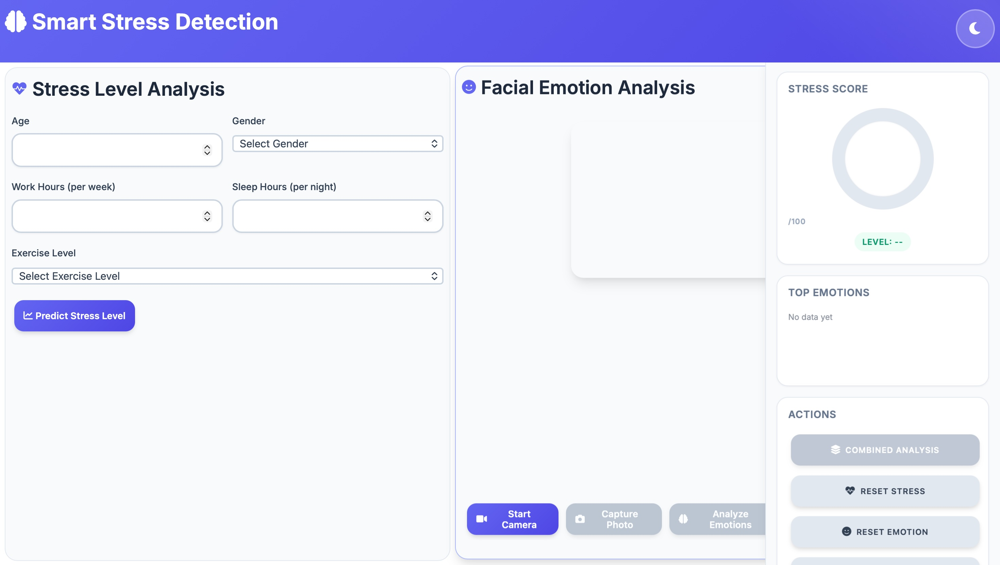

# Smart Stress Detection System




An AI-powered web application that combines lifestyle analysis with real-time facial emotion recognition to predict stress levels. The system uses machine learning models to provide comprehensive stress assessment through an interactive dashboard.

## 🚀 Features

- **Lifestyle Stress Prediction**: Analyzes age, gender, exercise level, sleep hours, and work hours
- **Facial Emotion Recognition**: Real-time emotion detection via webcam
- **Combined Analysis**: Integrates lifestyle and emotion data for accurate stress assessment
- **Interactive Dashboard**: Modern UI with real-time visual feedback
- **Multi-Model AI**: Random Forest/XGBoost for stress + CNN for emotion detection

## 🛠️ Technology Stack

- **Backend**: Flask (Python)
- **Frontend**: HTML5, CSS3, JavaScript
- **ML/AI**: PyTorch, scikit-learn, XGBoost
- **Computer Vision**: OpenCV, PIL

## 📊 Dataset & Model Details

### 1. Stress Prediction Model
- **Database**: Synthetic stress detection dataset (generated)
- **Total Samples**: 5,000
- **Training Data**: 4,000 samples (80%)
- **Testing Data**: 1,000 samples (20%)
- **Input Features**: 5 features
  - Age (18-65 years)
  - Gender (Male/Female)
  - Exercise Level (Low/Medium/High)
  - Sleep Hours (4-10 hours)
  - Work Hours per Week (20-80 hours)
- **Output**: Stress Score (0-100 continuous scale)
- **Models**: Random Forest Regressor & XGBoost Regressor
- **Best Model Performance**: R² Score > 0.90

### 2. Emotion Detection Model
- **Database**: FER2013 (Facial Expression Recognition 2013)
- **Total Samples**: ~35,000 images
- **Training Data**: ~28,000 images (80%)
- **Testing Data**: ~7,000 images (20%)
- **Input Features**: 48×48 grayscale facial images
- **Output Classes**: 7 emotions
  - Angry
  - Disgust
  - Fear
  - Happy
  - Neutral
  - Sad
  - Surprise
- **Model Architecture**: Custom CNN with 5 convolutional layers
- **Accuracy**: ~65% on test set

## 📋 Prerequisites

- Python 3.8 or higher
- Webcam (for emotion analysis)
- Modern web browser

## 🚀 Quick Start

### 1. Create Virtual Environment
**Windows:**
```bash
python -m venv SD_venv
```

**Linux/Mac:**
```bash
python3 -m venv SD_venv
```

### 2. Activate Virtual Environment
**Windows:**
```bash
SD_venv\Scripts\activate
```

**Mac/Linux:**
```bash
source SD_venv/bin/activate
```

### 3. Install Dependencies

```bash
cd Stress_Detect
pip install -r requirements.txt
```

### 4. Verify Model Files
Ensure these files exist in `models/` directory:
- `stress_model.pkl` - Stress prediction model
- `best_emotion_model.pth` - Emotion detection model

### 5. Run Application
**Windows:**
```bash
python app.py
```
**Linux/Mac:**
```bash
python3 app.py
```

### 6. Access Dashboard
Open browser and navigate to: **http://localhost:5001**

## 📖 How to Use

### Stress Analysis
1. Enter your personal information (age, gender, exercise level, sleep hours, work hours)
2. Click **"Predict Stress Level"**
3. View your stress score (0-100) and category (Low/Medium/High)

### Emotion Analysis
1. Click **"Start Camera"** to enable webcam
2. Click **"Capture Photo"** to take a snapshot
3. Click **"Analyze Emotions"** to detect emotions
4. View emotion percentages and dominant emotion

### Combined Analysis
1. Complete both stress and emotion analysis
2. The system automatically combines results
3. View adjusted stress score based on detected emotions

## 🏗️ Project Structure

```
Stress_Detect/
├── app.py                              # Flask backend
├── config.py                           # Configuration settings
├── requirements.txt                    # Python dependencies
├── README.md                           # Documentation
├── models/                             # AI models
│   ├── stress_model.pkl               # Stress prediction model
│   ├── best_emotion_model.pth         # Emotion detection model
│   └── stress_detection_dataset.csv   # Training dataset
├── templates/                          # HTML templates
│   └── index.html                     # Main dashboard
├── emotion/                            # Sample emotion images
├── outputs_emotion/                    # Emotion model outputs
├── output_stress/                      # Stress model outputs
└── SD_venv/                            # Virtual environment

```

## 🔧 API Endpoints

| Endpoint | Method | Description |
|----------|--------|-------------|
| `/` | GET | Main dashboard |
| `/predict_stress` | POST | Predict stress from lifestyle data |
| `/analyze_emotion` | POST | Analyze facial emotions from image |
| `/combined_analysis` | POST | Combined stress and emotion analysis |
| `/emotion/list` | GET | Get sample emotion images |

### Emotion Adjustment
**Stress-Increasing Emotions:**
- Angry: +15 points
- Fear: +12 points
- Sad: +10 points
- Disgust: +8 points

**Stress-Decreasing Emotions:**
- Happy: -10 points
- Neutral: -5 points
- Surprise: -3 points

### Final Score Formula
```
Final Stress Score = Lifestyle Score + Σ(Emotion% × Emotion Weight)
```

**Example:**
- Lifestyle Score: 45/100
- Emotions: 60% Happy, 25% Neutral, 15% Surprise
- Adjustment: (0.6 × -10) + (0.25 × -5) + (0.15 × -3) = -8 points
- **Final Score**: 45 - 8 = **37/100** (Low-Medium stress)

## 🎓 Training Notebooks

- `Stress_Model_Training.ipynb` - Stress prediction model training
- `EmotionDetect_V2.ipynb` - Emotion detection model training

## 📝 Notes

- The stress dataset is synthetically generated based on realistic patterns
- The emotion model uses the publicly available FER2013 dataset
- Both models are pre-trained and included in the `models/` directory
- The application works offline once models are loaded


---

